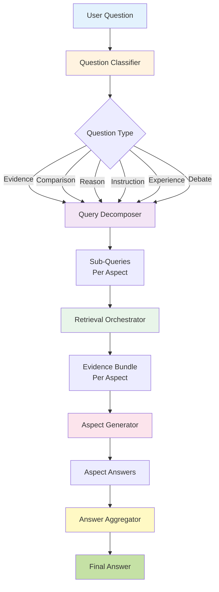
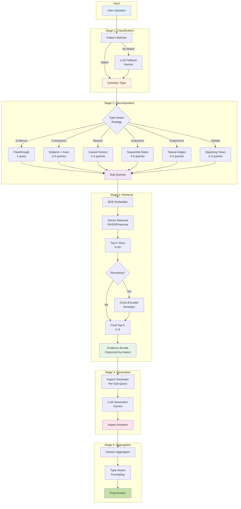
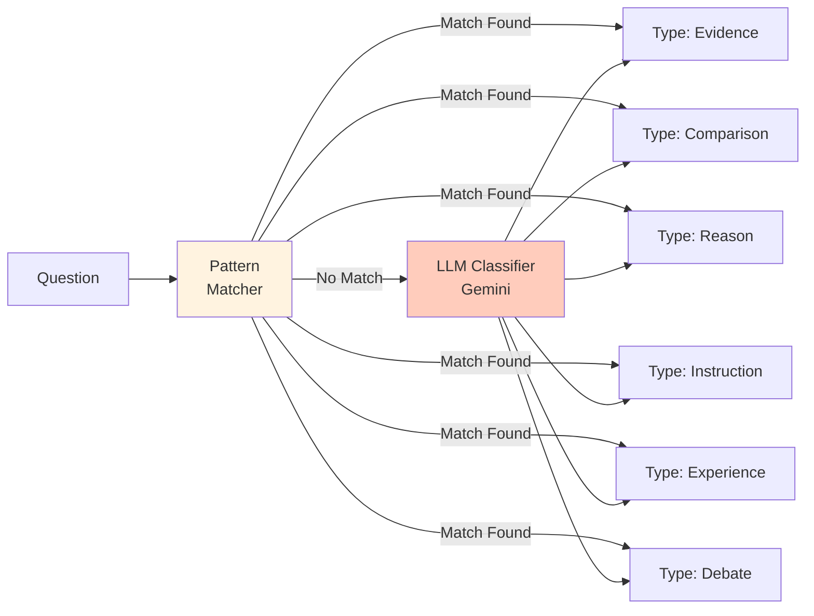
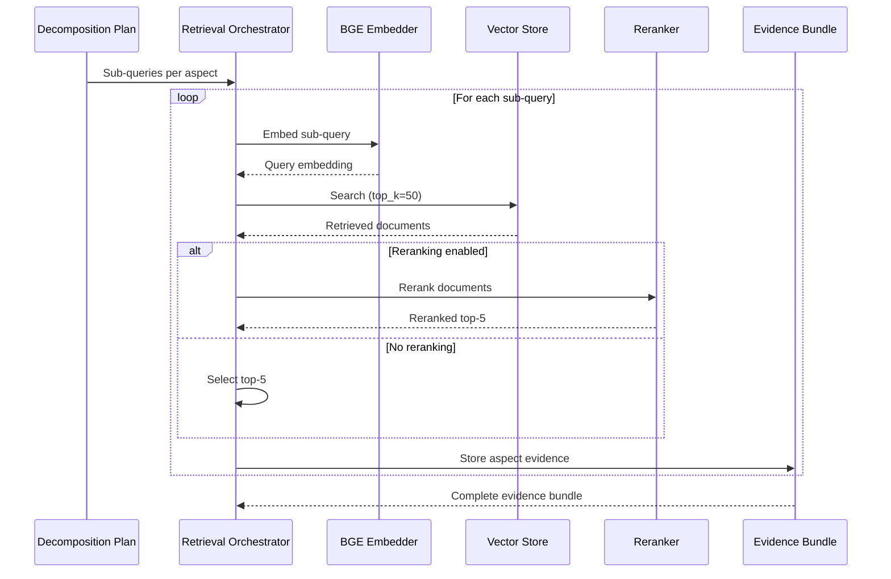
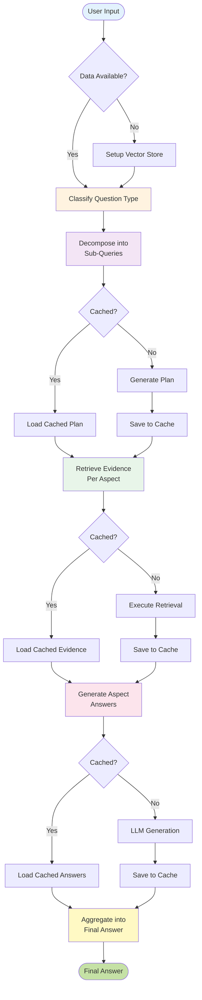
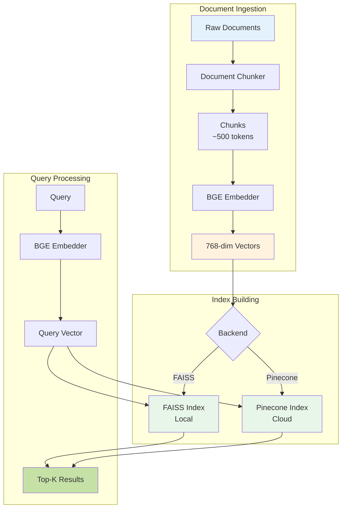
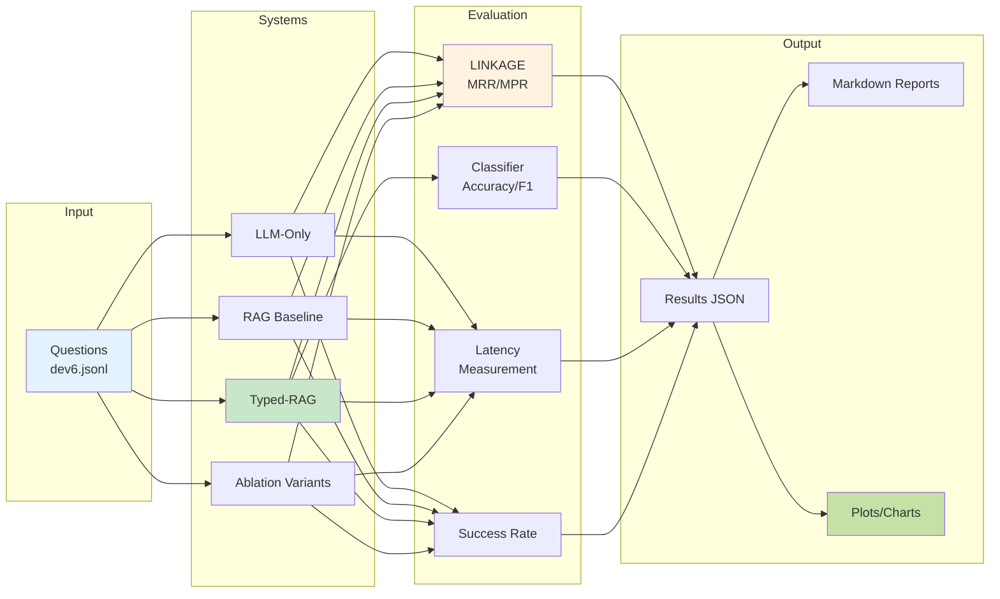
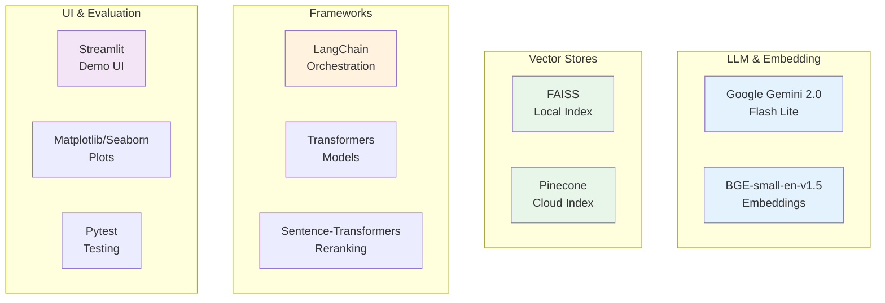
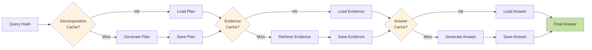

# Typed-RAG System Architecture

This document provides a comprehensive overview of the Typed-RAG system architecture, showing how components interact to process non-factoid questions with type-aware decomposition and retrieval.

## Table of Contents
- [High-Level System Flow](#high-level-system-flow)
- [Detailed Pipeline Architecture](#detailed-pipeline-architecture)
- [Component Interactions](#component-interactions)
- [Ablation Study Variants](#ablation-study-variants)
- [Data Flow Diagram](#data-flow-diagram)

---

## High-Level System Flow

The Typed-RAG system processes questions through five main stages: Classification, Decomposition, Retrieval, Generation, and Aggregation.

---

## Detailed Pipeline Architecture

This diagram shows the internal components and their interactions within each major stage.

---

## Component Interactions

### Question Classifier

**Pattern Examples:**
- Evidence: "What is...", "Define...", "Explain..."
- Comparison: "vs", "compared to", "difference between"
- Reason: "Why...", "What causes...", "How come..."
- Instruction: "How to...", "Steps to...", "Guide for..."
- Experience: "experiences with", "opinions on", "reviews of"
- Debate: "pros and cons", "advantages and disadvantages"

---

### Retrieval Orchestrator

---

## Ablation Study Variants

This diagram shows how different ablation variants modify the pipeline by disabling specific components.

```mermaid
graph TB
    subgraph "Full Typed-RAG (Baseline)"
        F1[Classification ✓] --> F2[Decomposition ✓]
        F2 --> F3[Retrieval ✓]
        F3 --> F4[Generation ✓]
    end
    
    subgraph "No Classification"
        N1[Classification ✗<br/>Force Evidence-based] --> N2[Decomposition ✓]
        N2 --> N3[Retrieval ✓]
        N3 --> N4[Generation ✓]
    end
    
    subgraph "No Decomposition"
        D1[Classification ✓] --> D2[Decomposition ✗<br/>Single Query]
        D2 --> D3[Retrieval ✓]
        D3 --> D4[Generation ✓]
    end
    
    subgraph "No Retrieval"
        R1[Classification ✓] --> R2[Decomposition ✓]
        R2 --> R3[Retrieval ✗<br/>Pure LLM]
        R3 --> R4[Generation ✓]
    end
    
    style F1 fill:#c8e6c9
    style F2 fill:#c8e6c9
    style F3 fill:#c8e6c9
    style F4 fill:#c8e6c9
    
    style N1 fill:#ffcdd2
    style D2 fill:#ffcdd2
    style R3 fill:#ffcdd2
```

**Component Impact:**
- **Classification**: ~1s overhead, enables type-aware decomposition
- **Decomposition**: Critical for multi-aspect questions, improves coverage
- **Retrieval**: 48% speedup vs pure LLM (3.81s vs 5.62s), provides evidence

---

## Data Flow Diagram

### Question Processing Flow

---

## Vector Store Architecture

---

## Evaluation Pipeline

---

## Technology Stack

---

## Key Design Decisions

### 1. Hybrid Classification
- **Pattern Matching (60%)**: Fast, deterministic, zero-cost
- **LLM Fallback (40%)**: Handles edge cases, high accuracy
- **Rationale**: Balance speed, cost, and accuracy

### 2. Type-Aware Decomposition
- **6 Question Types**: Evidence, Comparison, Reason, Instruction, Experience, Debate
- **Custom Strategies**: Each type has tailored decomposition logic
- **Rationale**: Better coverage of multi-aspect questions

### 3. Dense + Reranking Retrieval
- **Stage 1**: Dense retrieval (BGE + FAISS/Pinecone) - Broad recall
- **Stage 2**: Cross-encoder reranking - Precision refinement
- **Rationale**: Balance recall and precision

### 4. Aspect-Level Generation
- **Per-Aspect Answers**: Generate focused answers for each sub-query
- **Final Aggregation**: Combine with type-aware formatting
- **Rationale**: Better structured, comprehensive responses

---

## Performance Characteristics

| Component | Latency | Accuracy | Offline | Cost |
|-----------|---------|----------|---------|------|
| **Classification** | 200-500ms | 90-95% | Hybrid | $0.001/query |
| **Decomposition** | 100-300ms | N/A | ✓ | Free |
| **Retrieval** | 100-200ms | MRR: 0.47 | ✓ | Free |
| **Reranking** | 50-100ms | +10-15% | ✓ | Free |
| **Generation** | 500-1000ms | N/A | ✗ | $0.002/query |
| **Total** | ~2-4s | N/A | Hybrid | ~$0.003/query |

---

## Caching Strategy

**Cache Locations:**
- Decomposition: `cache/decomposition/{hash}.json`
- Evidence: `cache/evidence/{hash}.json`
- Answers: `cache/answers/{hash}.json`
- Final: `cache/final_answers/{hash}.json`

---

## References

- **Paper**: "Typed-RAG: Type-Aware Decomposition of Non-Factoid Questions"
- **Code**: [GitHub Repository](https://github.com/yourusername/Typed-Rag)
- **Demo**: Run `streamlit run app.py`
- **Evaluation**: See [EVALUATION.md](../EVALUATION.md)
